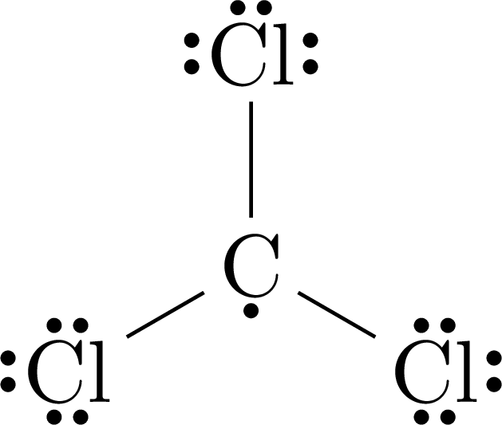
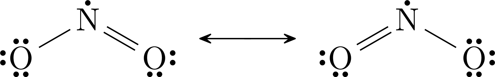
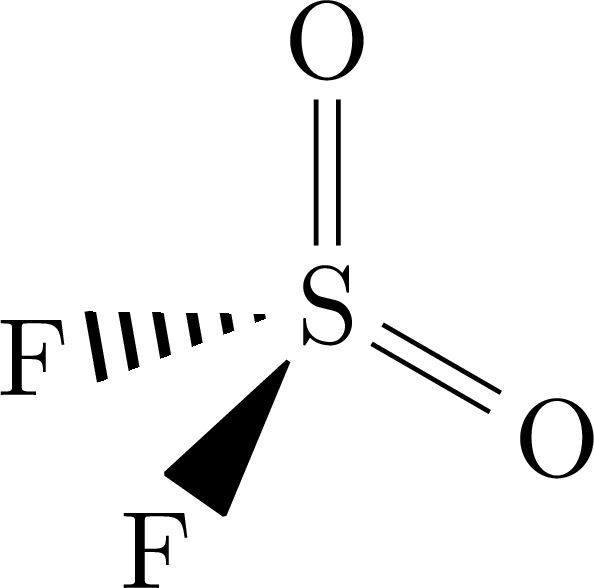
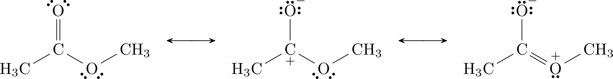
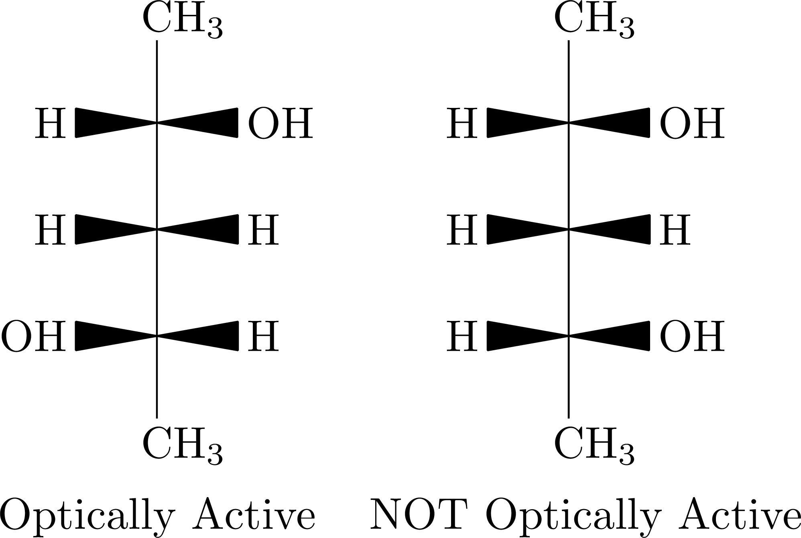
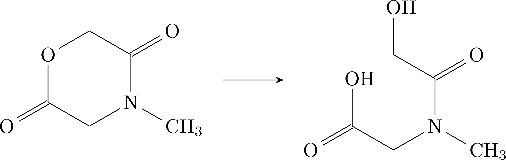
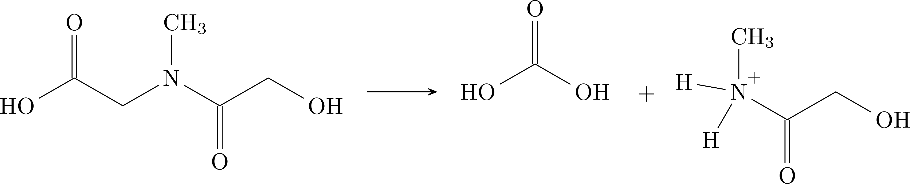

‐‐‐
title: Unofficial CCC 2016 Solutions
date: 1 April 2018
category: chemistry
tags: contest
slug: ccc/2016
summary: Unofficial full solutions and explanations to Part C of the 2016 Canadian Chemistry Contest/Olympiad.
‐‐‐

This is part of a [project](https://gautammanohar.com/ccc/) to provide unofficial solutions for part C of the [Canadian Chemistry Contest](http://www.cheminst.ca/outreach/canadian-chemistry-contest).
You can find the 2016 contest [here](https://gautammanohar.com/ccc/2016/problems.pdf).

# General Chemistry

## Part A

We are given $P_{\ce{O2}\text{in}} = 159 \,\mathrm{mmHg}$ and $P_{\ce{O2}\text{ex}} = 116\,\mathrm{mmHg}$.
Thus the change in partial pressure $\Delta P_{\ce{O2}} = 43 \,\mathrm{mmHg}$.
Converting to kilopascals, we have $760 \,\mathrm{mmHg} = 101.325 \,\mathrm{kPa}$, so the change in partial pressure is $\frac{43}{760}\cdot101325 = 5.733 \,\mathrm{kPa}$
There are ten inhalations per minute, each of volume 2 litres, so the inhalation rate is 20 litres per minute.
We use the ideal gas law to find the number of moles of oxygen transferred per minute:
\begin{equation}
	\begin{split}
		PV &= nRT \\
		n &= \frac{PV}{RT} \\
		&= \frac{5.733\cdot20}{8.31451\cdot298} \\
		&= 0.04627 \,\mathrm{mol}.
	\end{split}
\end{equation}
We multiply by the molar mass of oxygen, $16 \,\mathrm{g}\,\mathrm{mol}^{-1}$ to find mass:
\begin{equation}
	0.04627 \cdot 16 = 0.74 \,\mathrm{g}.
\end{equation}

## Part B

We use the ideal gas law to find the number of moles of oxygen transported in one litre of fully oxygenated blood:
\begin{equation}
	\begin{split}
		n &= \frac{PV}{RT} \\
		&= \frac{101.325 \cdot 0.18}{8.31451\cdot310} \\
		&= 7.076 \times 10^{-3}.
	\end{split}
\end{equation}
We then account for the fact that each hemoglobin molecule can carry four oxygen molecules and multiply by Avogadro's constant to convert moles to number of molecules.
\begin{equation}
	\frac{7.076 \times 10^{-3}}{4} \cdot 6.022 \times 10^{23} = 1.065 \times 10^{21}
\end{equation}
To two significant figures, the oxygen in one litre of blood requires $1.1 \times 10^{21}$ molecules of hemoglobin to be transported.

## Part C

We are given $T = 37^\circ \,\mathrm{C} = 310 \,\mathrm{K}$.
We use the relationship $\Delta G^\circ = -RT\ln K$.
For the first process, we have
\begin{equation}
	\Delta G^\circ = -8.31451\cdot310\cdot\ln(9.2\times10^{18}) = -110 \,\mathrm{kJ}\,\mathrm{mol}^{-1}.
\end{equation}
Similarly for the second process, we have
\begin{equation}
	\Delta G^\circ = -8.31451\cdot310\cdot\ln(2.3\times10^{23}) = -140 \,\mathrm{kJ}\,\mathrm{mol}^{-1}.
\end{equation}
Both of these processes have negative Gibbs free energies and very large equilibrium constants in the forward direction; they would have very small equilibrium constants in the reverse direction.
Both processes favour the forward reaction.

## Part D

The equilibrium in the carbon monoxide process lies closer to the products, because its corresponding equilibrium constant is larger.
This supports the notion that carbon monoxide is toxic, because it will preferentially attach to hemoglobin over oxygen, cutting off the supply of oxygen to your body.

## General Chemistry

## Part A

We assign sodium an oxidation state of $1+$ and oxygen $2-$.
Because the molecule is neutral, we conclude that chlorine has an oxidation state of $1+$ in sodium hypochlorite.

## Part B

We balance as follows:
\begin{equation}
	\ce{H3CNO2 + 3NaOCl -> Cl3CNO2 + 3NaOH}
\end{equation}

## Part C

Chlorine is reduced from oxidation state $1+$ to $1-$, and carbon is oxidized from $2-$ to $4+$.
And so this is a redox reaction.

## Part D

We have the reaction
\begin{equation}
	\ce{2Cl3CNO2 -> 2COCl2 + 2NO + Cl2}
\end{equation}

## Part E

We have $\Delta H^\circ_f = 2(-218.8) + 2(90.3) - 2(-78.6) = -99.8 \,\mathrm{kJ}\,\mathrm{mol}^{-1}_\mathrm{rxn}$.

## Parts F and G

First, we have $\ce{CCl3}$.
Carbon is the more electropositive atom, so it is central.
We have seven valence electrons per chlorine atom and four for the carbon, which makes 25 total.
Making three carbon-chlorine single bonds gives us 19 valence electrons remaining.
Placing 6 around each chlorine to complete the octet gives one remaining electron, which we place on the carbon atom.
It has trigonal planar geometry.

{ width=10% }

With $\ce{NO2}$, we have six valence electrons per oxygen atom and five for the nitrogen, whih makes 17 total.
Nitrogen is the central atom.
After making two nitrogen-oxygen bonds, we have 13 valence electrons left.
We place six around each oxygen atom, and place the last around the nitrogen.
However, the nitrogen atom has only two bonds to it, so we make an oxygen lone pair into a nitrogen-oxygen double bond, which gives two resonance forms.
It has bent geometry.

{ width=60% }

## Part H

We begin by using the information about compound C.
We can assume that B does not contain fluorine.
Then compound C has two atoms of fluorine, which have molar mass 38.
This gives compound C a molar mass of 102.06.
The fact that compound C has two-fold rotational symmetry indicates that it has formula $\ce{AB2F2}$, where A is the central atom.
This means $\ce{AB2}$ constitutes 64 grams of molar mass.
This corresponds to sulfur as $\ce{A}$ and oxygen as $\ce{B}$.
And so compound C is $\ce{SO2F2}$.
This means compound B is $\ce{SO2}$ and the element A is sulfur, $\ce{S}$.

## Part I

We know $\ce{SO2F2}$ has tetrahedral geometry.
Then it must have sulfur-oxygen double bonds and look as follows:

{ width=10% }

# Organic Chemistry

## Part A

The upper-right most carbon is part of an acetal, and the leftmost carbon is part of a hemi-ketal.

## Part B

We first note that in the lowest energy resonance structure, the ester has a carbonyl oxygen that is not part of the main chain.
We could also push the pi bond up, which makes the carbon have a formal positive charge and the carbonyl oxygen have a formal negative charge.
Then we could form a carbon-oxygen double bond in the main chain, shifting the positive formal charge to oxygen.
The resonance structures thus appear as follows:

{ width=90% }

## Part C

If a compound is optically active, then it has chirality centre(s), no internal plane of symmetry, and it must not be superimposable on its mirror image.
We shall focus on the last criterion.

{ width=40% }

Note that the second compound's mirror image, if rotated by 180 degrees, is superimposable on the original, whereas the same is not true for the first.
Note also that both molecules have chirality centers and no planes of symmetry.

## Part D

Compound D is clearly the least acidic; it will actually act as a base, donating its lone pair.
Then we consider the stability of the conjugate bases; the stronger/less stable the conjugate base, the weaker the acid.
Compound B has a localized negative charge on oxygen when deprotonated, whereas the conjugate bases of compounds A and C are stabilized by resonance.
Then we decide between A and C.
Both are carboxylic acids with the same structure, except C has a bromine in the alpha position.
Bromine is an electronegative atom which by the inductive effect draws some electron density away from the oxygen atoms, further delocalizing the negative charge.
And so our ranking of acids, from least to most acidic, is D, B, A, C.

## Part E

The degree of unsaturation of the first compound is three, as a totally saturated hydrocarbon with 14 carbons would have 30 hydrogens, while this compound only has 24 (six less).
The second compound has a degree of unsaturation of just one, by similar reasoning.
It must not contain any double bonds, as all would have been reduced by the catalyzed hydrogenation.
Thus its unsaturation must come from a ring.
Then the other two degrees of unsaturation in the original compound must have come from two double bonds.
Thus the original compound had one ring and two double bonds.

## Part F

We will consider the hydrolysis piecewise: first of the ester, then of the amide.
We form the carboxylic acid and alcohol

{ width=50% }

We unwrap to make it easier.
Then the nitrogen gains two protons and an alcohol is formed on the other side.

{ width=80% }

Above are the final products.

# Analytical Chemistry

## Part A

The limiting reagant is $\ce{As2O3}$.
We are given its molar mass and the mass dissolved in one litre of solution, so we can find its concentration to four significant figures:
\begin{equation}
	\frac{1.230}{197.841} = 6.217 \times 10^{-3} \,\mathrm{mol}\,\mathrm{L}^{-1}.
\end{equation}

## Part B

Silver readily forms precipitates; silver ions would react with the hydrogen arsenite to form a precipitate, which would of course render the titration impossible.
Silver chloride is also insoluble in water, and so chloride ions are added to remove all the silver.

## Part C

The procedure works because manganese in the steel is oxidized in the third step to permanganate, which is then analyzed in a redox titration againt sodium hydrogen arsenite.
However, chromium will also be oxidized.
If there is a high chromium content, then some manganese could still be left in metallic form, because chromium was oxidized instead of it.
This would result in an underestimation of the magnesium content.

## Part D

We split into a reduction half-reaction
\begin{equation}
	\ce{HAsO3^{2-} -> HAsO4^{2-}}
\end{equation}
which we balance as follows:
\begin{equation}
	\ce{HAsO3^{2-} + H2O -> HAsO4^{2-} + 2H+ + 2e-}
\end{equation}
We also have an oxidation half-reaction
\begin{equation}
	\ce{MnO4- -> Mn^{2+}}
\end{equation}
which we balance as follows
\begin{equation}
	\ce{MnO4- + 8H+ + 5e- -> Mn^{2+} + 4H2O}
\end{equation}
We multiply the reduction reaction by 5 and the oxidation reaction by 2, then add:
\begin{equation}
	\ce{2MnO4- + 5HAsO3^{2-} + 6H+ -> 5HAsO4^{2-} + 2Mn^{2+} + 3H2O}
	\label{redox}
\end{equation}

## Part E

From the first part, we know the concentration of hydrogen arsenite, $6.217 \times 10^{-3} \,\mathrm{mol}\,\mathrm{L}^{-1}$.
We can find the moles used given the volume:
\begin{equation}
	6.217 \times 10^{-3} \cdot 2.532 \times 10^{-2} = 1.574 \times 10^{-4} \,\mathrm{mol}.
\end{equation}
From \eqref{redox}, we know that for every five moles of hydrogen arsenite used, there were two moles of permanganate, so we can find the number of moles of permanganate.
\begin{equation}
	1.574 \times 10^{-4} \cdot \frac{2}{5} = 6.297 \times 10^{-5} \,\mathrm{mol}.
\end{equation}
Manganese is oxidized to permanganate in a one-to-one ratio, so we can now use the molar mass of manganese, $54.94 \,\mathrm{g}\,\mathrm{mol}^{-1}$, to find the original mass of manganese.
\begin{equation}
	6.297 \times 10^{-5} \cdot 54.94 = 3.459 \times 10^{-3}.
\end{equation}
And so in the steel sample there was $3.459 \times 10^{-3}\,\mathrm{g}$ of manganese.

# General Chemistry

## Part A

The second dissociation constant is negligible to the final pH of the solution, so we can just use the first.
Suppose the initial concentration of $\ce{H+}$ is $y$.
Setting up an ICE table, we have
\begin{equation}
	K_{a1} = 1.0 \times 10^{-7} = \frac{[\ce{HS-}][\ce{H+}]}{\ce{H2S}} = \frac{x(y+x)}{0.100 - x},
\end{equation}
where $x = \ce{[HS-]}$.
We know the solution pH is 2, so $y + x = 10^{-2}$.
Making this substitution, we solve for $x$:
\begin{equation}
	\begin{split}
		K &= \frac{10^{-2} x}{0.1 - x} \\
		0.1K &= (K + 10^{-2})x \\
		x &= \frac{0.1K}{K + 0.01} \\
		x &= 9.9999 \times 10^{-7}.
	\end{split}
\end{equation}
We then perform another ICE calculation, this time letting $x = [S^{2-}]$.
We have
\begin{equation}
	\begin{split}
		K_{a2} &= \frac{x10^{-2}}{9.9999 \times 10^{-7} - x} \\
		100K(9.9999 \times 10^{-7} - x) &= x \\
		999.99K &= x + 100Kx \\
		x &= \frac{999.99K}{100K + 1} \\
		x &= 1.3 \times 10^{-10}.
	\end{split}
\end{equation}
And so we conclude that the concentration of sulfide ion is $1.3 \times 10^{-10} \,\mathrm{mol}\,\mathrm{L}^{-1}$.

## Part B

We can assume we have a solution of volume one litre to simplify the notation.
We know that a compound with solubility product $K$ has a molar solubility of $\sqrt{K}$.
We start with the most soluble compound, as that is what will preferentially stay in solution.
At most $\sqrt{2.5 \times 10^{-10}} = 1.6 \times 10^{-5} \,\mathrm{mol}$ of $\ce{MnS}$ will dissolve.
We know from the previous part that, under the given conditions, $1.3 \times 10^{-10} \,\mathrm{mol}$ sulfide is in solution.
Thus no \ce{MnS} precipitate is formed.
However, silver sulfide and cobalt sulfide, by the same analysis, will precipitate.

## Part C

We first find $\ce{[Pb^{2+}]} = \sqrt{K_{sp}} = \sqrt{1.6\times10^{-8}} = 1.26 \times 10^{-4}$.
Then let $x$ be the moles of lead (II) sulfide precipitate formed.
Let $A = \sqrt{1.6\times10^{-8}}, B = 1.00 \times 10^{-17}, C = 2.5 \times 10^{-27}$
We have
\begin{equation}
	\begin{split}
		(1.26 \times 10^{-4} - x)(1.00 \times 10^{-17} - x) &= 2.5 \times 10^{-27} \\
		(A - x)(B - x) &= C \\
		x^2 - (A+B)x + AB - C \\
		x &= \frac{A+B-\sqrt{(A+B)^2 - 4(AB-C)}}{2} \\
		&= 1 \times 10^{-17}.
	\end{split}
\end{equation}
So in fact, essentially all of the lead will precipitate out; the difference is not detectable with our number of significant digits.
The molar mass of lead (II) sulfide is $239.3 \,\mathrm{g}\,\mathrm{mol}^{-1}$.
And so $1 \times 10^{-17} * 239.3 = 2.39 \times 10^{-15}\,\mathrm{g}$ of precipitate forms.