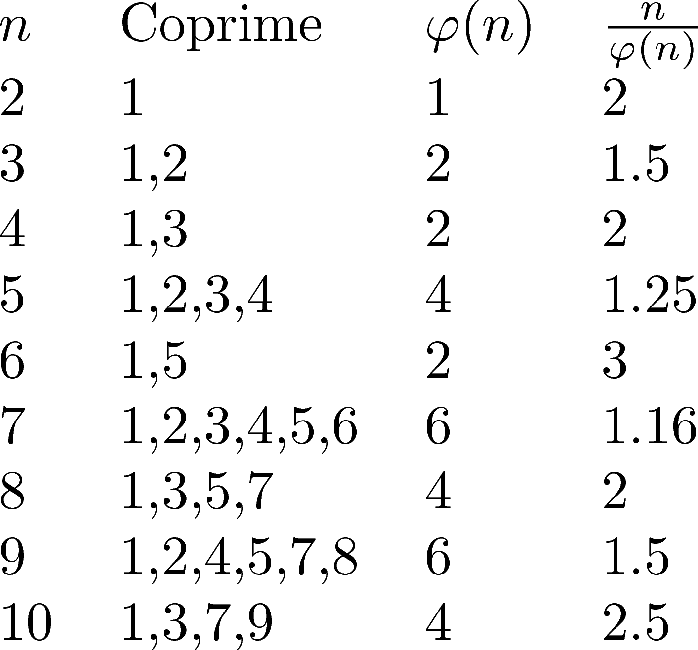

‐‐‐
title: Problem 69 - Totient Maximum
date: 16 July 2018
category: euler
tags: proof
slug: euler/69
problem: 69
summary: My solution to problem 69 of Project Euler.
‐‐‐

# Problem Statement

Euler's totient function, $\varphi(n)$, counts the number of positive integers less than $n$ that are coprime to $n$.

{ width=30% }

Given $N$, find the smallest value $n$ such that $\frac{n}{\varphi(n)}$ achieves a maximum.

# My Algorithm

We use Euler's product formula for the totient function,
\begin{equation}
	\varphi(n) = n\prod\limits_{p|n}\left(1 - \frac{1}{p}\right),
\end{equation}
taken over the distinct primes dividing $n$.
This formula gives
\begin{equation}
	\frac{n}{\varphi(n)} = \frac{1}{\prod\limits_{p|n}\left(1 - \frac{1}{p}\right)}.
\end{equation}

Therefore, to maximize $\frac{n}{\varphi(n)}$, we must minimize the product.
This is done when $n$ is a product of many distinct primes.
We want as many of these primes as possible to be small, so that their reciprocals are big.
And so $n$ should be the product of the first $k$ primes, for some $k$.
That is, $n$ is the $k$-th [primorial number](https://en.wikipedia.org/wiki/Primorial).
The first primorial number greater than $10^18$ is the product of the primes up to 41.

Our solution consists of multiplying primes until the given upper bound is reached.
Because the $n$-th primorial has size about $e^n$, our solution is $O(\log n)$.