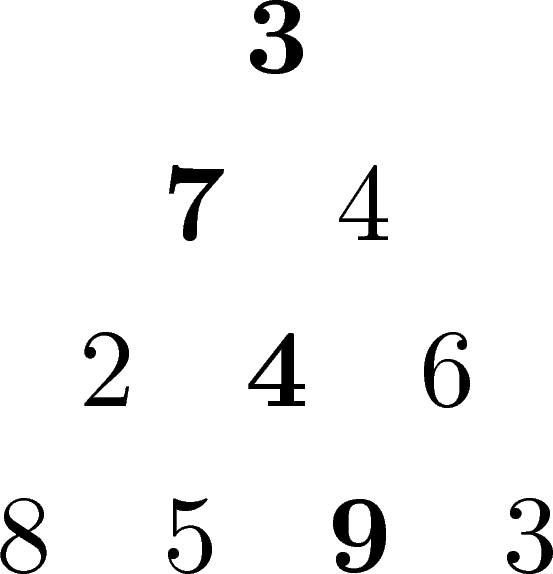

‐‐‐
title: Problem 67 - Maximum Path Sum II
date: 11 June 2018
category: euler
tags: greedy
slug: euler/67
problem: 67
summary: My solution to problem 67 of Project Euler.
‐‐‐

# Problem Statement

By starting at the top of the triangle below and moving to adjacent numbers on the row below, the maximal total from top to bottom is 23.

{ width=10% }

Find the maximum path length for a given such triangle with 100 rows.

# My Algorithm

Please see [Problem 18](../18/), which has an identical solution.